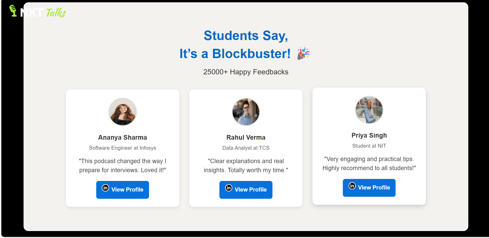

# NXT Talks Clone

A clone of the NXT Talks web app built using HTML, CSS, and JavaScript. This project demonstrates a **responsive landing page** with multiple sections such as Home, About, Services, Features, Portfolio, Team, and Contact.

---

## Features

- Fully responsive layout for desktop and mobile  
- Hero section with a call-to-action button  
- About, Services, Portfolio, and Team sections  
- Contact form (frontend only)  
- Smooth scrolling between sections  

---
## Screenshots

### Home Page


### Companies Section


### Videos Section


### Claim Section


### Feedback Section


### Dreams Section


### Contact Section


---

## Technologies Used

- HTML5  
- CSS3  
- JavaScript  

---

## Installation / Usage

1. Clone the repository:

```bash
git clone https://github.com/vidya200000/nxt-talks-clone.git
```

## Author

**Vidya Patil**  
[GitHub Profile](https://github.com/vidya200000)

## License

This project is licensed under the MIT License. See the [LICENSE](LICENSE) file for details.
